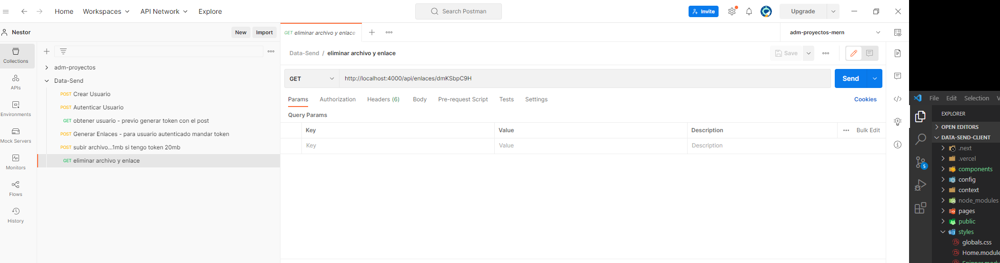
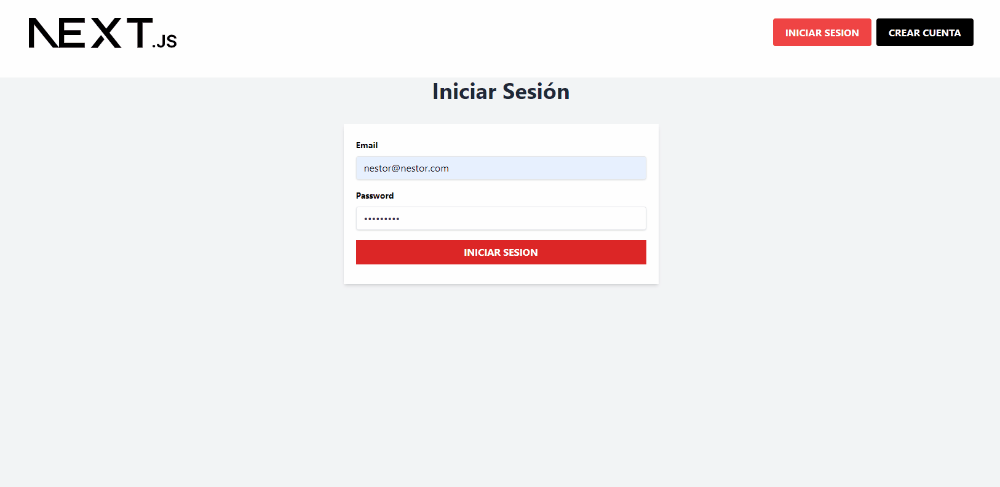

## App para compartir archivos

### Backend realizado con [NODE.js](https://nodejs.org/en) y [MongoDB](https://www.mongodb.com/).

App para enviar archivos de forma segura.
Una vez subido el archivo genera un link de descarga para compartir.
Si no estas registrado se pueden subir archivos hasta 1MB.
Con el usuario registrado aumenta la capacidad, tambien se elegir la cantidad de veces que el archivo se va a descargar.
Pueden ser 1, 5 o 10 veces.
Una vez que el enlace es utilizado se elimina el archivo de la base de datos.

TODO: Spinner mientras se logea el usuario. Tarda, pero se conecta

Desarrollo Frontend realizado con [NEXT.js](https://nextjs.org/).
Framework css - [Tailwindcss](https://tailwindcss.com/docs/installation)
Deploy Frontend realizado con [VERCEL](https://vercel.com)

Dirección del sitio: [DATA-SEND](https://data-send-client.vercel.app)

Dependencias utilizadas:

- [bcrypt](https://www.npmjs.com/package/bcrypt)
- [cors](https://www.npmjs.com/package/cors)
- [dotenv](https://www.npmjs.com/package/dotenv)
- [jsonwebtoken](https://www.npmjs.com/package/jsonwebtoken)
- [express-validator](https://www.npmjs.com/package/express-validator)
- [multer](https://www.npmjs.com/package/multer)
- [shortid](https://www.npmjs.com/package/shortid)

###### Correr la aplicación:

### `npm run dev`

